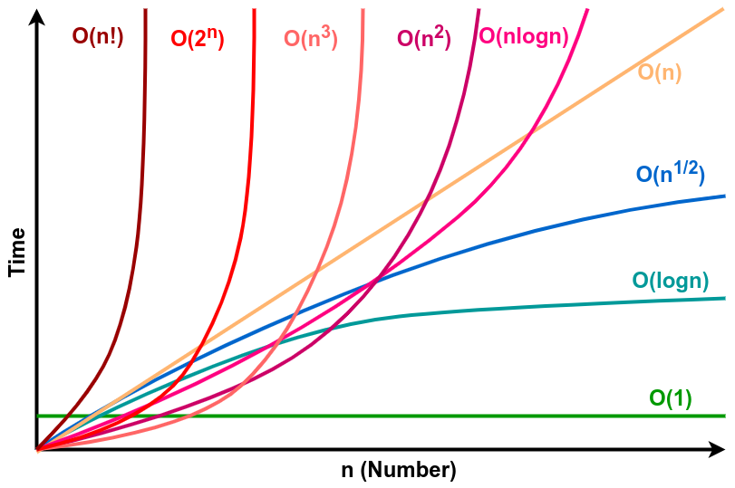
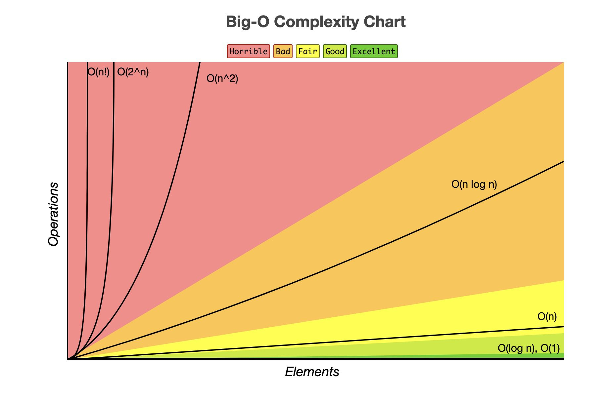
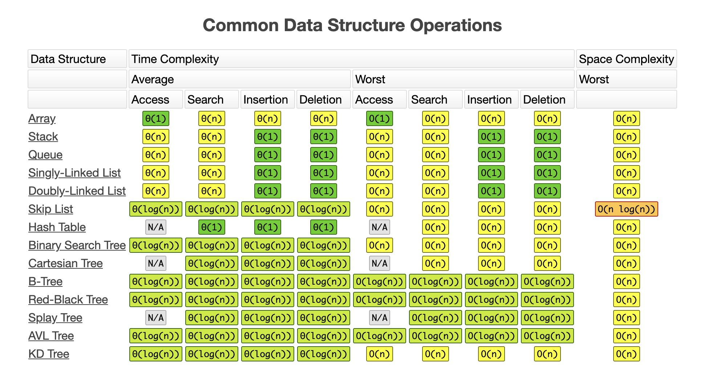

# Review-Fudamentals
## Cấu trúc dữ liệu và giải thuật
### 1. Độ phức tạp thuật toán (Big O)

Time/Space Complexity
Xác định dựa trên độ phức tạp về thời gian chạy thuật toán và độ phức tạp về không gian (vùng nhớ)

BigO là định lượng xác định số phép toán phải chạy với so với kích thước đầu vào, việc cân đo dựa trên Big O giúp lựa chọn giải thuật phù hợp và tối ưu hơn.

Một số chỉ số phức tạp của thuật toán:

| Big O Notation | Name         | Details                                                                                                                                         |
|----------------|--------------|-------------------------------------------------------------------------------------------------------------------------------------------------|
| O(1)           | Constant     | Các lệnh đơn (lệnh khai báo, gán, nhập xuất dữ liệu, phép toán số học,...), không phụ thuộc vào dữ liệu đầu vào. vd: a + b,                     |
| O(log n)       | Logarithmic  | Số phép tính (thời gian thực hiện) tăng theo kích thước dữ liệu theo hàm logarit. vd: tìm kiếm nhị phân.                                        |
| O(n)           | Linear       | Số phép tính phụ thuộc vào dữ liệu đầu vào theo 1 biến. vd: tìm kiếm tuyến tính, loop                                                           |
| O(n log n)     | Linearithmic | Tổng hợp của n và logn (lồng nhau). vd: Heap sort, Merge sort.                                                                                  |
| O(n^2)         | Quadratic    | Vòng lặp lồng nhau. Ví dụ tìm xem trong tập hợp có phần tử trùng nhau không.                                                                    |
| O(n^3)         | Cubic        | Ba vòng lặp lồng nhau. Ví dụ tính bài toán: 3*x + 5*y + 9 * z = 100                                                                             |
| O(2^n)         | Exponential  | Thời gian chạy theo cấp số nhân (cơ số 2) có nghĩa là các phép tính được thực hiện bởi một thuật toán sẽ tăng gấp đôi mỗi khi đầu vào tăng lên. |
| O(n!)          | Factorial    | Thời gian chạy giai thừa như hoán đổi một chuỗi.                                                                                                |

Các quy tắc tính toán độ phức tạp thuật toán:
* Các lệnh đơn (lệnh khai báo, gán, nhập xuất dữ liệu, phép toán số học,...): Thời gian o(1)
* Các khối lệnh: giả sử khối lệnh bao gồm các câu lệnh s1, s2, s3 với thời gian thực hiện lần lượt là O(f1(n)), O(f2(n)), O(f3(n)) thì thời gian thực hiện khối lệnh là O(max(O(f1(n)), O(f2(n)), O(f3(n))))
* Thời gian thực hiện câu lệnh rẽ nhánh: O(max(**_thời gian thực hiện từng khối if_**))
* Câu lệnh lặp: Giả sử thực hiện phần thân là O(f(n)) và số lần lặp là g(n) thì thời gian thực hiện vòng lặp là: O(f(n)*g(n))

### 2. Sắp xếp và tìm kiếm nhị phân
#### Sort
* Bubble sort
* Selection sort
* Insertion sort
* Quick sort
* Heap sort

#### Tìm kiếm nhị phân
* BFS
* DFS

### 3. Các phương pháp sinh
* Sinh nhị phân
* Sinh hoán vị
* Sinh tổ hợp
* Sinh chỉnh hợp
### 4. Đệ quy, quay lui

### 5. Cấu trúc dữ liệu stack, queue, dequeue

### 6. Quy hoạch động

### 7. Đồ thị.

------------
## OOP
  ### 1. Các tính chất
  1. Tính trừu tượng
  2. Tính đa hình
  3. Tính đóng gói
  4. Tính kế thừa
## Vòng lặp
------------

## Đệ quy
------------

## Callback
------------

------------

## Cơ chế hoạt động của web
------------

------------

## Bạn có thể tự hỏi, mình học gì khi học 1 ngôn ngữ mới? Đây là câu trả lời:

  * Cách khai báo hàm, biến
  * Cách khai báo vòng lặp, điều kiện if/else
  * Các kiểu cấu trúc dữ liệu: list, set, tuple, …
  * IO, multi-thread, delegate, event
  * IDE phù hợp, cách build, debug
  * Các framework, cách sử dụng, ….